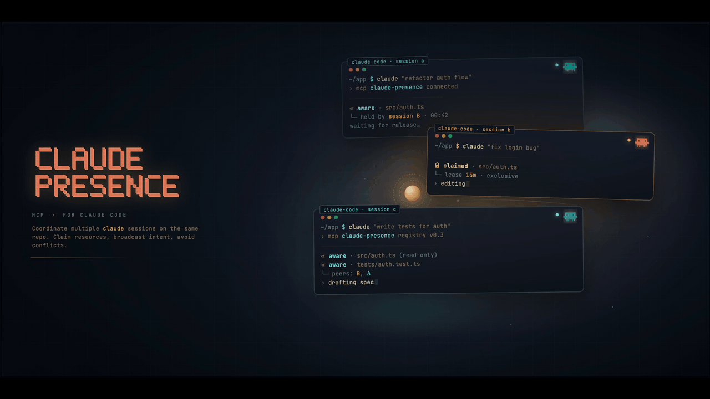

# claude-presence

[](https://github.com/garniergeorges/claude-presence/actions/workflows/ci.yml)
[](./LICENSE)
[](https://nodejs.org/)

<picture>
  <source media="(prefers-reduced-motion: no-preference)" srcset="./assets/banner.gif">
  
</picture>

> Minimal MCP server for inter-session coordination between parallel Claude Code instances.

🇫🇷 [Version française](./README.fr.md)

When you run multiple Claude Code sessions on the same repo, they don't know about each other. They step on each other's CI runs, push over each other, or duplicate work. `claude-presence` is a small MCP server that gives each session a view of the others, plus advisory locks on shared resources (CI, staging DB, ports, whatever you name).

> **Mental model.** Sessions don't talk directly — each Claude Code session is an isolated process. `claude-presence` gives them a shared bulletin board: each session sees who else is working, what resources are claimed, and can post short messages that others will read when they check in. Think of it as a lightweight coordination layer, not a chat bridge.

**Scope is deliberately small.** Presence + resource locks + a broadcast inbox. No git integration, no task orchestration, no web UI. If you need more, look at [mcp_agent_mail](https://github.com/Dicklesworthstone/mcp_agent_mail).

---

## Table of contents

- [Quick start](#quick-start-60-seconds)
- [Features](#features)
- [Install](#install)
- [Configure](#configure)
- [Verify it works](#verify-it-works)
- [Slash commands](#slash-commands-recommended)
- [Hooks (optional)](#hooks-optional)
- [MCP tools exposed](#mcp-tools-exposed)
- [CLI](#cli)
- [Troubleshooting](#troubleshooting)
- [How it compares](#how-it-compares)
- [Team mode (v0.2+)](#team-mode-v02)
- [Security & trust model](#security--trust-model)
- [Storage](#storage)
- [Development](#development)
- [Status](#status)

---

## Quick start (60 seconds)

```bash
# 1. Install the package globally
git clone https://github.com/garniergeorges/claude-presence
cd claude-presence && npm install && npm run build && npm link

# 2. Install the slash commands for every Claude Code session
cp commands/*.md ~/.claude/commands/

# 3. Add the MCP server to any project you want to coordinate
cd /path/to/your/project
cat > .mcp.json <<'EOF'
{
  "mcpServers": {
    "claude-presence": { "type": "stdio", "command": "claude-presence-mcp" }
  }
}
EOF

# 4. Open Claude Code in that project and type:
#    /register  → you're now visible to other sessions
#    /presence  → see who else is working here
#    /claim ci  → reserve the CI before you push
```

That's the whole loop. Everything below is detail.

---

## Features

- **Presence registry** — each session registers itself with a branch and an intent; others see it
- **Resource locks** — claim a named resource (`"ci"`, `"deploy:staging"`, `"port:3000"`) before you touch it; others get a clear "busy" response
- **Broadcast inbox** — drop a short message that other sessions on the same project will see
- **Slash commands** — `/register`, `/presence`, `/claim`, `/release`, `/broadcast`, `/inbox` (no typing ceremony)
- **CLI** — `claude-presence status` shows active sessions outside Claude Code
- **Zero daemon (stdio mode)** — SQLite-backed, no port, no background process for solo / single-machine use
- **Team mode (v0.2+)** — optional self-hosted HTTP server with bearer-token auth and RBAC for coordination across machines
- **TTL-based cleanup** — dead sessions (no heartbeat for 10 min) are removed automatically

## Install

### From source (current)

```bash
git clone https://github.com/garniergeorges/claude-presence
cd claude-presence
npm install
npm run build
npm link       # exposes claude-presence (CLI), claude-presence-mcp (stdio),
               # and claude-presence-server (HTTP, v0.2+) globally
```

### From npm (when published)

```bash
npm install -g claude-presence
```

Or invoke via `npx` directly from `.mcp.json` — no global install needed.

## Configure

Add `claude-presence` to your project's `.mcp.json`:

```json
{
  "mcpServers": {
    "claude-presence": {
      "type": "stdio",
      "command": "claude-presence-mcp"
    }
  }
}
```

If you already have other MCP servers, just add this block alongside them — don't replace the whole file. Example with an existing `semgrep` entry:

```json
{
  "mcpServers": {
    "semgrep": {
      "type": "stdio",
      "command": "semgrep",
      "args": ["mcp"]
    },
    "claude-presence": {
      "type": "stdio",
      "command": "claude-presence-mcp"
    }
  }
}
```

### Install the slash commands (recommended)

```bash
cp commands/*.md ~/.claude/commands/
```

Now in any Claude Code session, you can type `/register`, `/presence`, `/claim <resource>`, `/release <resource>`, `/broadcast <message>`, `/inbox`.

## Verify it works

After configuring `.mcp.json`, restart Claude Code in the project, then check:

```bash
# The CLI and MCP binaries must be on PATH:
which claude-presence           # → /opt/homebrew/bin/claude-presence (or similar)
which claude-presence-mcp       # → same dir

# The CLI runs:
claude-presence status          # → "No active sessions." on first run
```

Inside Claude Code, type `/mcp`. You should see `claude-presence` listed with **9 tools**. If it's missing, see [Troubleshooting](#troubleshooting).

Then try `/register test` — the session should register and the tool reply should list any other active sessions on this project.

## Slash commands (recommended)

No ceremony. Just type:

| Command | What it does |
|---|---|
| `/register [intent]` | Register this session with optional intent (branch + cwd auto-detected). |
| `/presence` | Show other sessions + active locks on this project. |
| `/claim <resource> [reason]` | Claim a named resource lock. If busy, shows the holder instead of proceeding. |
| `/release <resource>` | Release a lock you hold. |
| `/broadcast <message>` | Post a short message to the project inbox. Other sessions see it on their next `/inbox`. |
| `/inbox [all\|unread]` | Read messages from other sessions. Default: unread only. |

### Example workflow

Session A starts work on `feat/login`:

```
/register fixing the login redirect bug
```

Session A is about to push and trigger CI:

```
/claim ci pushing feat/login
→ ok: true, held until 10:05
```

Meanwhile, session B on `fix/nav` tries the same:

```
/claim ci pushing fix/nav
→ ok: false — already held by session-a1b2 on feat/login since 09:55
   Want to wait, broadcast, or abort?
```

Session A finishes CI and releases:

```
/release ci
```

Session B can now proceed.

## Hooks (optional)

The slash commands cover 99% of daily use. Hooks are optional polish for the last 1%:

- **`hooks/session-start.sh`** runs when you open a new Claude Code session. It prints a short reminder so you remember to `/register` and think about resource locks before shared ops. It does **not** auto-register the session (by design — the slash command keeps it explicit).
- **`hooks/user-prompt-submit.sh`** runs on every user prompt. It injects a one-line system message into the context when other sessions or locks are active on this project, so Claude Code stays aware without you asking.

> The `UserPromptSubmit` hook shells out to the `claude-presence` CLI, so it must be on your `PATH` (handled by `npm link` or `npm install -g`). If the CLI is missing, the hook silently exits 0 — no breakage.

### Enable them

**Back up your settings first**:

```bash
cp ~/.claude/settings.json ~/.claude/settings.json.backup-$(date +%Y%m%d-%H%M%S)
```

Then merge the two hook entries into `~/.claude/settings.json`. If the `hooks` section doesn't exist yet:

```json
{
  "hooks": {
    "SessionStart": [
      { "matcher": "", "hooks": [
        { "type": "command", "command": "/absolute/path/to/claude-presence/hooks/session-start.sh" }
      ]}
    ],
    "UserPromptSubmit": [
      { "matcher": "", "hooks": [
        { "type": "command", "command": "/absolute/path/to/claude-presence/hooks/user-prompt-submit.sh" }
      ]}
    ]
  }
}
```

### Merging with existing hooks

If another tool already registers hooks on `SessionStart` or `UserPromptSubmit` (GitKraken CLI, custom scripts, etc.), **don't overwrite them** — add a second entry in the same `hooks` array. Example coexisting with GitKraken:

```json
{
  "hooks": {
    "SessionStart": [
      { "matcher": "", "hooks": [
        { "type": "command", "command": "\"/Users/you/Library/Application Support/GitKrakenCLI/gk\" ai hook run --host claude-code" },
        { "type": "command", "command": "/absolute/path/to/claude-presence/hooks/session-start.sh" }
      ]}
    ],
    "UserPromptSubmit": [
      { "matcher": "", "hooks": [
        { "type": "command", "command": "\"/Users/you/Library/Application Support/GitKrakenCLI/gk\" ai hook run --host claude-code" },
        { "type": "command", "command": "/absolute/path/to/claude-presence/hooks/user-prompt-submit.sh" }
      ]}
    ]
  }
}
```

Claude Code runs every command in the array in order. Both tools get their turn.

## MCP tools exposed

| Tool | Purpose |
|---|---|
| `session_register` | Declare this session (project, branch, intent) |
| `session_heartbeat` | Keep this session alive |
| `session_unregister` | Clean exit |
| `session_list` | List active sessions on the same project |
| `resource_claim` | Acquire advisory lock on a named resource |
| `resource_release` | Release a lock |
| `resource_list` | List active locks |
| `broadcast` | Post a message to the project inbox |
| `read_inbox` | Read recent messages |

## CLI

```bash
claude-presence status              # Show all active sessions
claude-presence status --project .  # Filter to current project
claude-presence locks               # Show active resource locks
claude-presence clear               # Prune dead sessions and expired locks
claude-presence path                # Print the SQLite DB path
claude-presence help                # Show help
```

Add `--json` to any command for machine-readable output.

## Troubleshooting

**`/mcp` doesn't list `claude-presence`.**
Make sure `.mcp.json` is at the project root (same directory as Claude Code was opened in), the `command` field matches an executable on `PATH`, and you **fully restarted** Claude Code after editing the file (not just reloaded).

**`command not found: claude-presence-mcp`.**
Run `which claude-presence-mcp`. If empty, run `npm link` again from the `claude-presence/` directory. If you installed via `npm install -g`, check that your npm global bin directory is on `PATH` (`npm config get prefix`).

**The slash commands don't appear.**
Slash commands are loaded at session start. Restart Claude Code after `cp commands/*.md ~/.claude/commands/`. Type `/` to see the list.

**`claude-presence status` shows 0 sessions even though Claude Code is open.**
`claude-presence` doesn't auto-register — you must call `/register` once per session. This is deliberate: sessions stay explicit and identifiable.

**A lock is stuck because a session crashed.**
Dead sessions are pruned after 10 min (no heartbeat). You can force-clean immediately with `claude-presence clear`, or force-release a specific lock with the `resource_release` MCP tool passing `force: true`.

**Hooks seem to break my existing GitKraken / custom hook setup.**
See [Merging with existing hooks](#merging-with-existing-hooks). Each event holds an array of hooks; add yours without removing others.

## How it compares

| | claude-presence | [mcp_agent_mail](https://github.com/Dicklesworthstone/mcp_agent_mail) | [parallel-cc](https://github.com/frankbria/parallel-cc) |
|---|---|---|---|
| Presence registry | ✅ | ✅ | ✅ |
| File-level locks | ❌ | ✅ | ✅ |
| **Named resource locks** (CI, ports, DBs) | ✅ | ⚠️ (via file paths) | ❌ |
| Messaging | minimal inbox | full mailbox | ❌ |
| Git integration | ❌ | ✅ | ✅ (worktrees) |
| Slash commands shipped | ✅ | ❌ | ❌ |
| **Team mode** (cross-machine, self-hosted) | ✅ HTTP + RBAC | ❌ | ❌ |
| Docker image (multi-arch, signed) | ✅ | ❌ | ❌ |
| LOC | ~2700 | several thousand | ~2000 |

Pick `claude-presence` if you want something small and focused on "don't let my sessions step on each other". Pick `mcp_agent_mail` if you want rich agent-to-agent workflows.

## Team mode (v0.2+)

For coordinating across multiple machines (a real team, not just one developer's parallel sessions), there is a self-hosted HTTP variant. Same MCP tools, exposed through `claude-presence-server` over HTTP with bearer-token auth and RBAC.

Four deploy paths supported: Docker Compose (localhost or with Caddy + HTTPS), bare metal with systemd, Kubernetes manifests. All in [`deploy/`](./deploy/).

Full guide: [`docs/team-mode.md`](./docs/team-mode.md) (English) / [`docs/team-mode.fr.md`](./docs/team-mode.fr.md) (French).

The stdio mode (`claude-presence-mcp`) keeps working unchanged for solo and single-machine use.

## Security & trust model

`claude-presence` is designed for **cooperating local sessions on a single developer machine**, not for adversarial multi-tenant use. Concretely:

- The SQLite database lives in your home directory and is only reachable by processes running as you.
- Session IDs and `from_session` fields are **self-declared** — the server doesn't authenticate them. A buggy or malicious local process could register as any ID or post broadcasts claiming to be another session.
- Resource locks are **advisory**, not enforced. A session can ignore a held lock and push anyway. The value comes from every session agreeing to check first.

This is fine for the intended use case (your own parallel Claude Code sessions cooperating) and explicitly not fine for running untrusted code on the same box. If you need cryptographic identity or server-side enforcement, this isn't the right tool.

See [#1](https://github.com/garniergeorges/claude-presence/issues) track hardening ideas for future versions (e.g. deriving `from_session` from the MCP connection context instead of accepting it as an argument).

## Storage

Data lives in `~/.claude-presence/state.db` (SQLite, WAL mode). Nothing is sent anywhere.

Override the path with `CLAUDE_PRESENCE_DB=/custom/path.db`.

Tables:
- `sessions`, `resource_locks`, `inbox`, `inbox_reads` — coordination state
- `team_tokens`, `audit_log` — only used by `claude-presence-server` (team mode v0.2+)

Retention:
- **Sessions**: pruned after 10 min without heartbeat.
- **Locks**: pruned when their TTL expires (default 10 min, configurable per-claim, max 24 h).
- **Inbox**: pruned after 24 h.
- **Audit log**: kept indefinitely; query and prune manually if needed.

## Development

```bash
npm run build               # compile TypeScript
npm run dev                 # watch mode
npm test                    # vitest, 69 tests, ~5s
node dist/index.js          # run the stdio MCP server (claude-presence-mcp)
node dist/server/index.js   # run the HTTP server (claude-presence-server, v0.2+)
```

Project layout:

```
src/
  index.ts            # stdio MCP server entrypoint
  db/                 # SQLite schema + typed repository
  tools/              # MCP tool implementations (presence, locks, inbox)
  cli/                # claude-presence CLI + token admin sub-command
  auth/               # bearer-token auth, RBAC, audit log (v0.2+)
  server/             # HTTP entrypoint, transport, health, logger (v0.2+)
hooks/                # SessionStart + UserPromptSubmit scripts
commands/             # 6 slash commands (register, presence, claim, release, broadcast, inbox)
examples/             # sample .mcp.json and settings.json hook snippets
deploy/               # Dockerfile-based deployments for team mode
  docker-compose.yml          # localhost variant
  docker-compose.caddy.yml    # public domain + auto HTTPS
  Caddyfile.example
  k8s/                        # Deployment + Service + PVC + Secret example
docs/
  team-mode.md / .fr.md       # bilingual deploy guide
.github/workflows/
  ci.yml                      # build + test on Ubuntu + macOS x Node 18/20/22
  docker.yml                  # buildx multi-arch + cosign + Trivy (v0.2+)
```

## Status

**v0.2 — team mode.** The stdio MCP server is stable; the HTTP team-mode server is new and the auth/RBAC surface may still evolve based on feedback. Postgres backend planned for v0.3 (currently SQLite only).

Feedback and PRs welcome at [github.com/garniergeorges/claude-presence](https://github.com/garniergeorges/claude-presence).

## License

MIT
